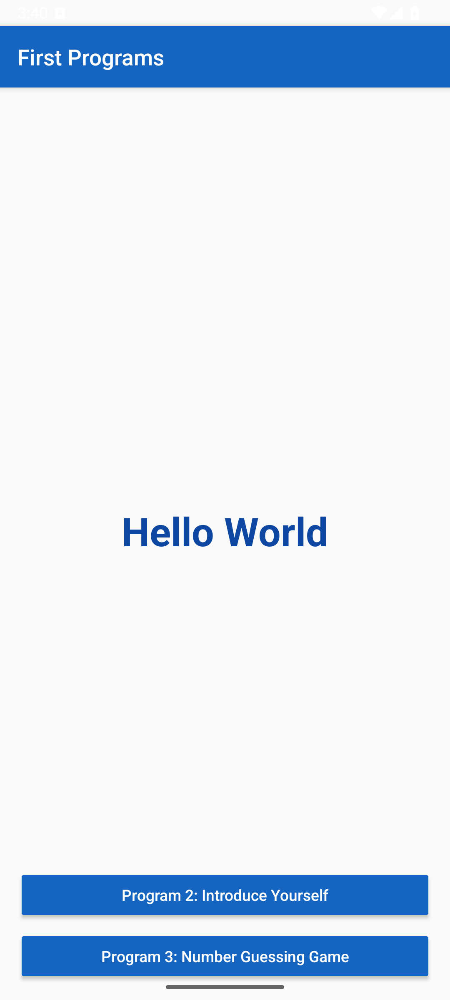
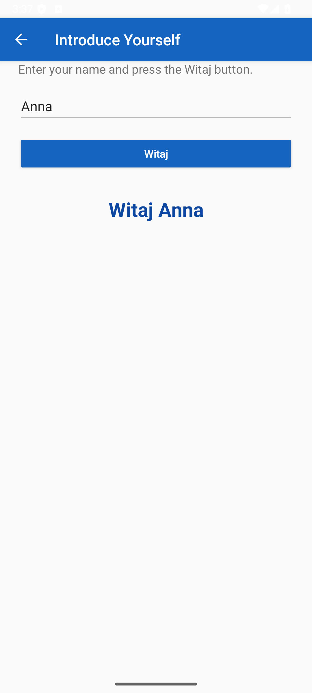
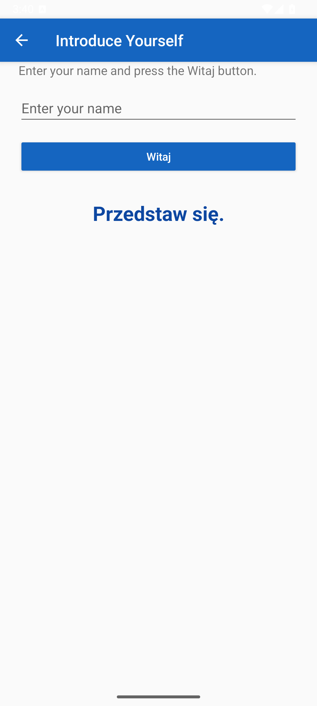
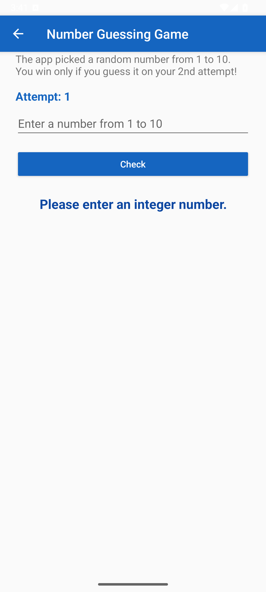
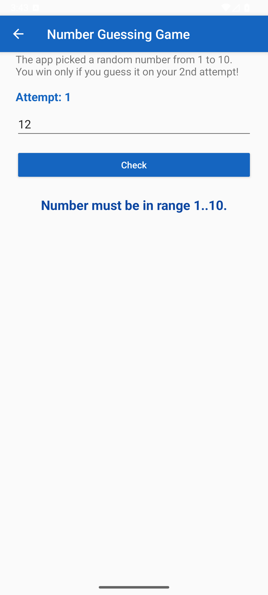
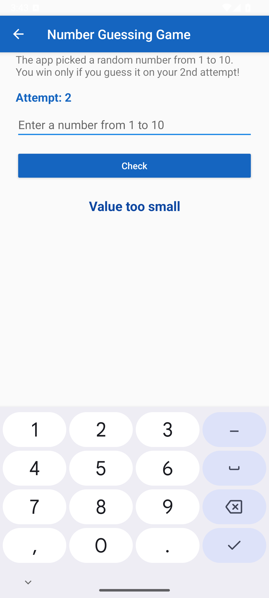
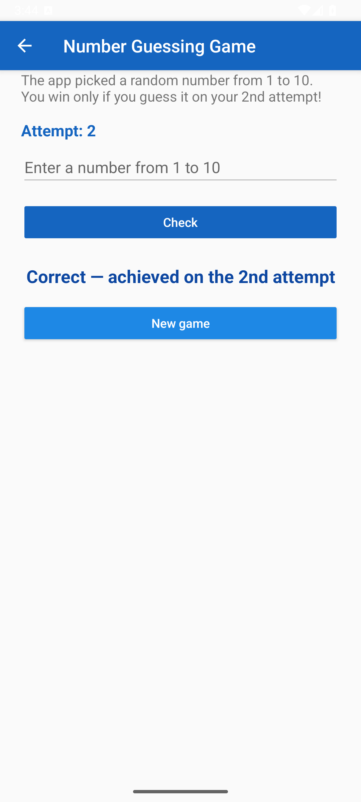

# Lab 1 — First Programs (Android, Java)

- **Course:** Introduction to Mobile Systems
- **Lab number:** 1
- **Student:** Hasan Yilmaz
- **Student ID:** 56505

**Description:** An Android app (Java) bundling three introductory programs in one project: a Hello World screen with the text centered on screen, an "Introduce Yourself" greeter that validates input and replies "Witaj &lt;name&gt;" (or "Przedstaw się." when empty), and a number guessing game over the range 1–10. The Hello World screen is the launcher; two buttons open the other two programs.

Android Studio project (Java) implementing the three lab tasks in a single app:

| Part | Program | Screen |
|------|---------|--------|
| A | **Hello World** | `MainActivity` — shows **Hello World** centered horizontally and vertically, visible immediately on start |
| B | **Introduce Yourself** | `IntroduceActivity` — `EditText` + **Witaj** button + result `TextView` |
| C | **Number Guessing Game** | `GuessActivity` — random number 1..10, win only on the 2nd attempt |

The Hello World screen is the launcher screen; the two buttons at the bottom open Program 2 and Program 3.

## Behavior

**Part B — Introduce Yourself**
- Non-empty input (after trimming spaces) → `Witaj <input>` (e.g. "Anna" → **Witaj Anna**)
- Empty input / only spaces → exactly **Przedstaw się.**

**Part C — Number Guessing Game**
- The app picks a random integer in **1..10** (inclusive) using `java.util.Random.nextInt`.
- Valid guesses are counted starting from **1**; feedback per guess: **Value too small** / **Value too large**.
- The game **ends only** when the number is guessed on the **2nd attempt** → **Correct — achieved on the 2nd attempt**.
- Correct on attempt 1 or attempt ≥ 3 → **Correct, but not on the 2nd attempt. Try again.** and a new round starts immediately (new random number, attempt counter reset).
- Empty / non-integer input → **Please enter an integer number.** — out of range → **Number must be in range 1..10.** Invalid input never increases the attempt counter.

## Screenshots

| Hello World | Witaj <name> | Empty input |
|---|---|---|
|  |  |  |

| Invalid input | Out of range | Too small | Win on 2nd attempt |
|---|---|---|---|
|  |  |  |  |

## Build & run

Open the project in Android Studio and press **Run**, or from the command line:

```bash
./gradlew assembleDebug
# APK: app/build/outputs/apk/debug/app-debug.apk
```

- compileSdk/targetSdk 36, minSdk 26, Java 11 source level, AGP 8.11, Gradle 8.14.3.
- No third-party dependencies (AndroidX AppCompat only).
